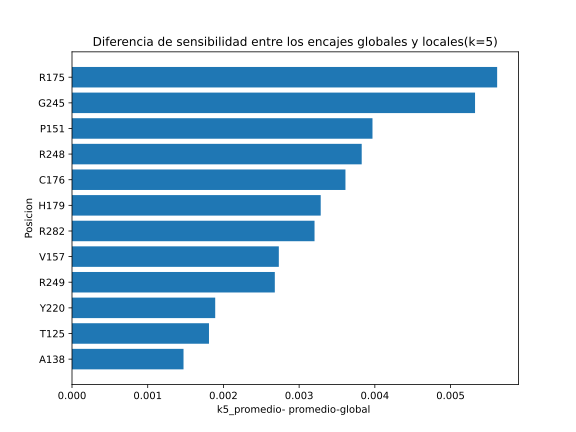
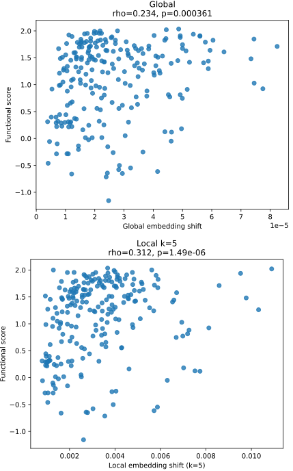
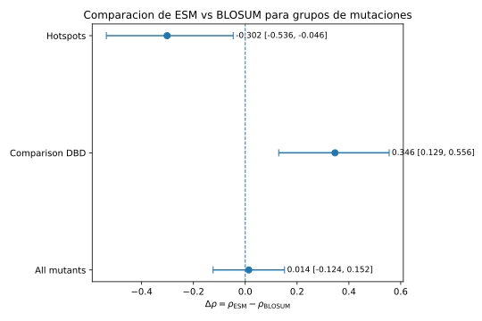

# Local beats global: estimating TP53 mutation effects with ESM-2 embeddings

A single amino-acid substitution can disable a protein — and predicting which
missense mutations are harmful from sequence alone remains one of the hardest
problems in computational biology. TP53, the most frequently mutated gene in
human cancer, is a prime example: thousands of its variants have known
functional effects, but most possible substitutions remain uncharacterized.

Classical methods like BLOSUM62 score substitutions using aggregate evolutionary
data, but they ignore the sequence context around the mutation. Protein language
models such as ESM-2 promise more: contextual, per-residue embeddings. The
question is how to turn them into a mutation-effect score. Should you compare
whole-protein embeddings, or focus on the neighborhood of the mutated site?

To find out, I built a synthetic panel of 228 point mutants across 12 positions
in the TP53 DNA-binding domain and embedded wild-type and mutant sequences with
ESM-2 (650M). Comparing WT–mutant cosine distances globally and in local windows
(k=0/3/5) showed that global averaging dilutes the signal of a single
substitution, while a local window (k=5) recovers a stronger, more
interpretable perturbation — one that correlates significantly with experimental
MAVE-DB functional scores.

The twist: against BLOSUM62 there is no uniform winner. ESM-2 outperforms
BLOSUM62 in a comparative DBD subset where local context matters, while BLOSUM62
remains competitive at canonical hotspots, where the chemistry of the
substitution already tells most of the story. Representation — local vs
global — mattered as much as the model itself.

The takeaway: protein language models don't automatically replace classical
baselines; they add value where local sequence context carries information that
substitution chemistry alone misses.

Want to dig in? All code, notebooks, figures and the full report are in the
repo — [github.com/rubal501/ems2-mutations-project](https://github.com/rubal501/ems2-mutations-project).
Clone it, run the notebooks, and reproduce the analysis.
